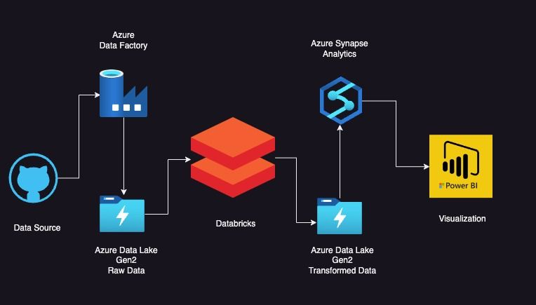

# Data Engineering on Olympics dataset using Azure Services
Leveraging Azure cloud services: End-to-end Data Engineering project on Olympics Dataset

## Architecture Diagram

## Project Tasks
1.	Get the data from the data source 
https://www.kaggle.com/datasets/arjunprasadsarkhel/2021-olympics-in-tokyo/
2.	Ingest the raw data into the data lake using the data factory 
3.	Apply some transformations on the data in the Databricks platform using Apache spark
4.	Store the transformed data back in the data lake 
5.	Analyze the transformed data using Synapse Analytics 
6.	Build Dashboards using Power BI, Tableau, or Looker studio

## Services Used
1. Azure Data Factory
2. Azure Data Lake storage Gen 2
3. Azure Data Bricks
4. Apache Spark
5. Azure Synapse Analytics
6. Power BI
